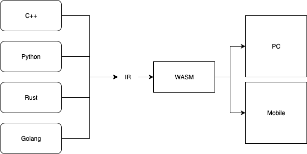
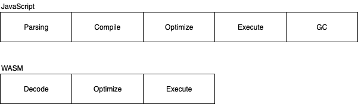

<!--
theme: gaia
class: lead
-->

# WebAssembly

---

# What is WebAssembly?

---

- It is not a language
- A set of low-level binary format so other language can compile to
- Cross-browser\*
- Non-Web Embeddings
- JS Interface to WASM

---

---

# Performance?

---

- Faster than JS to load and execute
- JS will perform the same as WASM if the code is optimize

---

---

# Why WebAssembly?

- Image / Video Processing ([squoosh](https://squoosh.app))
- Gaming ([Unreal Engine](https://s3.amazonaws.com/mozilla-games/ZenGarden/EpicZenGarden.html))
- Porting existing library to web ([Qt](https://www.qt.io/qt-examples-for-webassembly))

---

# Demo

---

# Conclusion

---

- It is not to "kill" javascript
- It is meant to solve some very niche problem

---

# End
